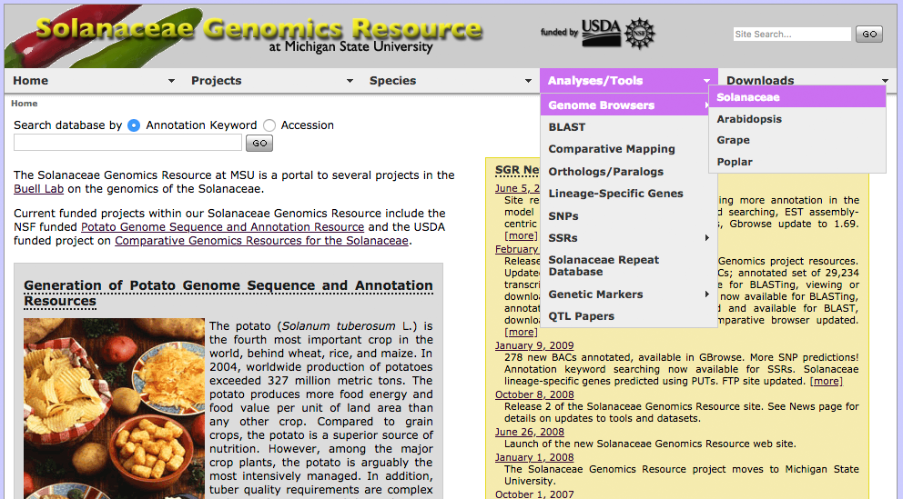

# "Solanaceae Genomics Resource"
## C. Robin Buell Lab, Michigan State University

See ["Solanaceae Genomics Resource" poster](https://www.slideshare.net/BrettWhitty/20100903whittybsolanaceaegenomicsresourceposter) (2010) and [project overview slides](https://www.slideshare.net/BrettWhitty/solanaceae-comparative-genomics-prl-lunchtime-seminar-2009) (2009) at SlideShare.

Check it out at Web Archive: [solanaceae.plantbiology.msu.edu](https://web.archive.org/web/20100614210848/http://solanaceae.plantbiology.msu.edu/) \(2010\)

#### Project Lead / Bioinformatics Engineer:

Brett Whitty [brett@gnomatix.com], 2008-2011

### Notes

#### Version, Authorship, Copyright, etc.
This code is an SVN checkout from ~ Sept. 2009; it contains development code, and doesn't correspond to a 'final' versioned site release.

The site provided access to a number of tools and datasets, a few of which represent the work of legacy projects carried forward from The Institute for Genomic Research/J. Craig Venter Institute's Plant Biology group.

I have tried to exclude legacy code and data where possible to respect authorship rights, but may have overlooked some code that has been included here. <em>Please contact me if you are an author of something here and would like it removed</em>. I have included some 3rd party libraries and tools that are dependencies for site function, and to my knowledge have retained their accompanying copyright notices; again will remove if requested.

#### Server Setup

##### Apache2 config

Expected site setup is as an Apache2 virtual host (eg: 'solanaceae.plantbiology.msu.edu').

With repo dirs mapped like so:

    ./htdocs  => /
    ./cgi-bin => /cgi-bin/

It requires Apache2 support for PHP[5+], Perl CGI (mod\_perl), and mod\_rewrite.

See README.md in './htdocs' for details on why / how mod\_rewrite is used.

##### DB dependencies
The site's code, being in-development, has a patchwork of real database and BDB-type data dependencies. Some of the necessary site data, and tools for generating data files are included; others are not.

One main database dependency is a custom DB used for managing a local mirror of GenBank's Solanaceae sequence records. A set of Perl modules ('Sol::SeqDB') provides an interface to this database, and it is in this repository under 'cgi-bin/lib'.

Scripts for fetching these data from GenBank and loading to Sol::SeqDB are in my 'bw-msu-tools' repository.

Some custom search features make use of the Bio::SeqFeature::Store DBs for each of the site's GBrowse-based genome browsers.

As a project policy, all of the site's data (eg: sequence records, annotation, custom analysis, etc.) was ultimately encoded into GFF3, loaded to DBs for querying / genome browsers, and available for download through the FTP site.

After fully adopting GFF3, I did some experimentation with using the GMOD GFF3 to Chado DB loader, and was experimenting with using a Chado DB for driving some of the site's CGI scripts. One example of this is 'cgi-bin/ssr_db_query.cgi'.

The site has dynamic content with database dependencies that must be instantiated for
full function; most, if not all, of the scripts for creating these database dependencies
should be located in the root of this code repository under these dirs:

    /solcomp
    /shell_scripts/solcomp/
    
The site also includes several Gbrowse instances, for which configuration files are present in the tree. The Gbrowse DBs were using Bio::DB::SeqFeature::Store populated from GFF3 files. Many of the custom utility scripts used for transforming the various data and analysis results to GFF3 for loading are in the root of this repository under:
    
    /gff

#### Funding
This project was supported by the <strong>National Research Initiative (NRI) Plant Genome Program</strong> of the USDA
<strong>Cooperative State Research, Education and Extension Service (CSREES)</strong> grant to C. Robin Buell (<strong>2008-35300-18671</strong>).

