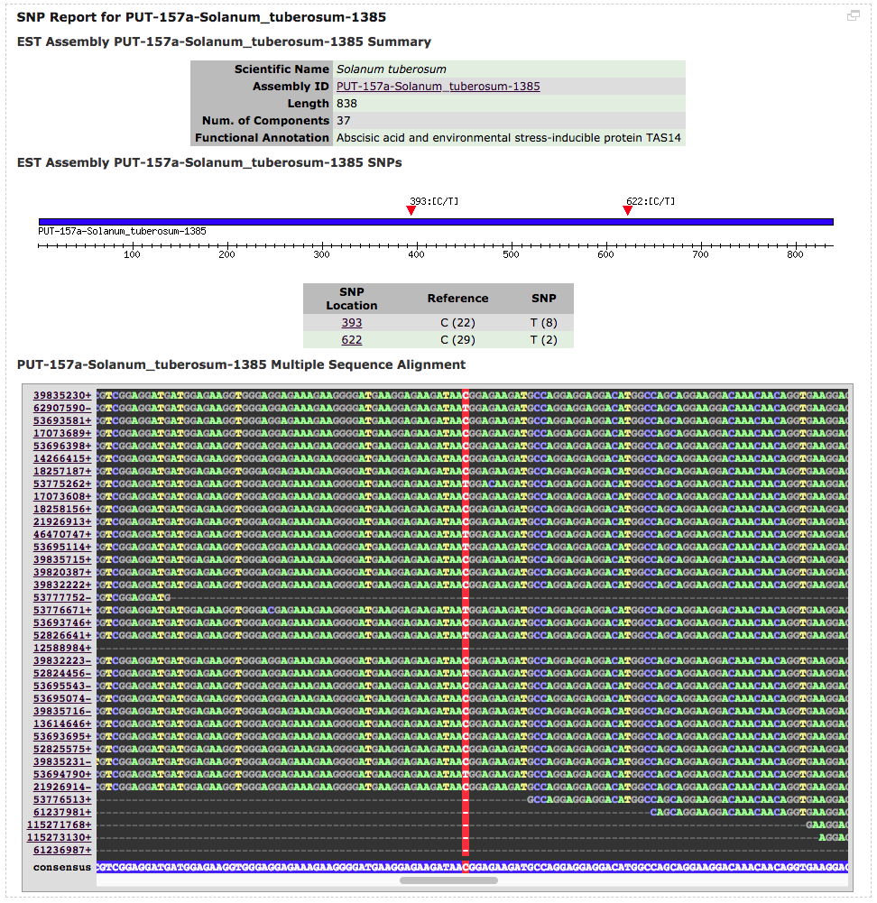

## /cgi-bin/SNP

SNP tools.

### msa.cgi

An HTML-based multiple sequence alignment viewer built on top of Bio::SimpleAlign; uses the following custom modules (included under 'cgi-bin/lib'):

    Sol::SimpleAlign::DBIReader
    Sol::SimpleAlign::Reader
    Sol::SimpleAlign::Util

...used in this CGI script to render MSA view of PlantGDB PUTs assemblies. This is an example of a simple use-case of the module.

Requires proper CSS styling to be rendered properly, see '/htdocs/css/solcomp\_style.css#msa*'.

### sol\_snps.cgi / sol\_snps.grp.cgi

The normal and gene report page-embedded version of the SNP report tool. Makes full use of Sol::SimpleAlign to highlight SNP positions.

Legacy TIGR code was used to render overview glyph with GD; added an image map to support auto-scroll to
SNP positions in the Sol::SimpleAlign MSA frame when clicked in the overview glyph.

Here's a screenshot of the script [in use on the site](https://web.archive.org/web/20100614155409/http://solanaceae.plantbiology.msu.edu/analyses_snp.php):

Requires proper CSS styling to be rendered properly, see '/htdocs/css/solcomp\_style.css#msa*'.
