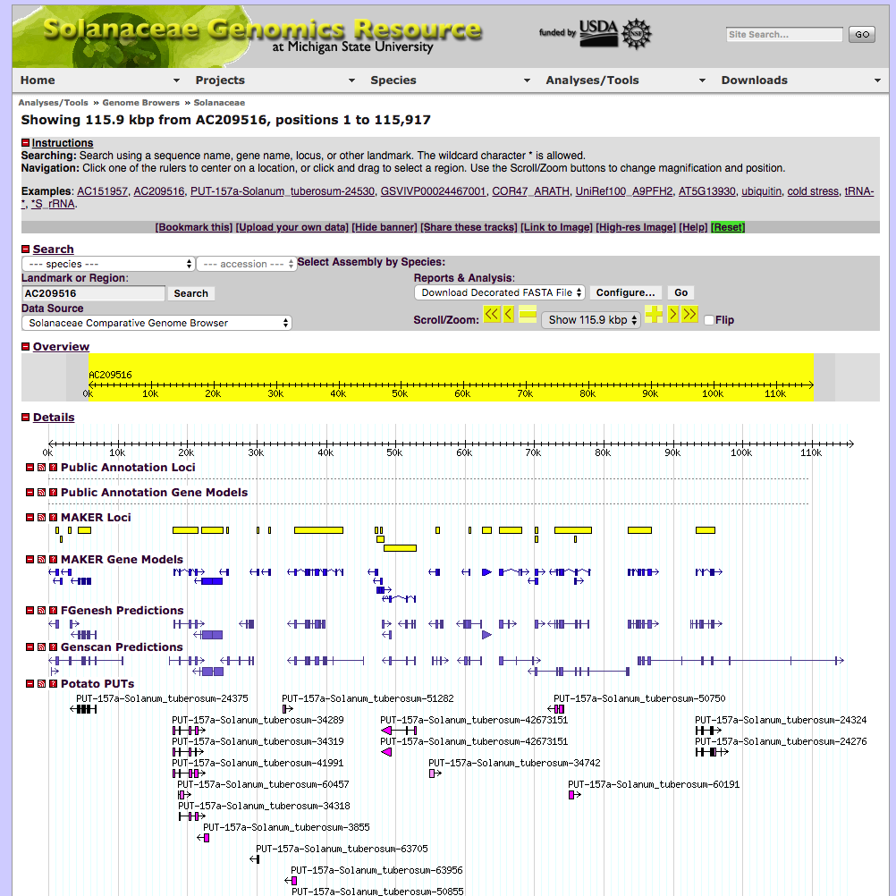

## gbrowse.conf

GBrowse 2.0 config files for the site's genome browsers.

See [Solanaceae Genomics Resource](https://www.slideshare.net/BrettWhitty/20100903whittybsolanaceaegenomicsresourceposter) poster at SlideShare.

See [archived content at web.archive.org](https://web.archive.org/web/20100614171905/http://solanaceae.plantbiology.msu.edu/cgi-bin/gbrowse/solanaceae/).

### Annotated Solanaceae Contigs Browser

#### solanaceae.conf

The main Solanaceae browser had annotation data for all Solanaceae contigs publicly released to Genbank (including those submitted by the Buell Lab).

Various analysis results, including common gene set annotations generated using [MAKER](http://www.yandell-lab.org/software/maker.html), were consisently produced for all contigs. See config file for track details.

### Comparative Browsers

Genome browsers for plant reference genomes with aligned Solanaceae transcript assemblies and other annotations. See each config file details on annotation tracks that were present in the browsers.

#### arabidopsis.conf

Arabidopsis genome.

#### grape.conf

Grape genome.

#### poplar.conf

Poplar genome.
