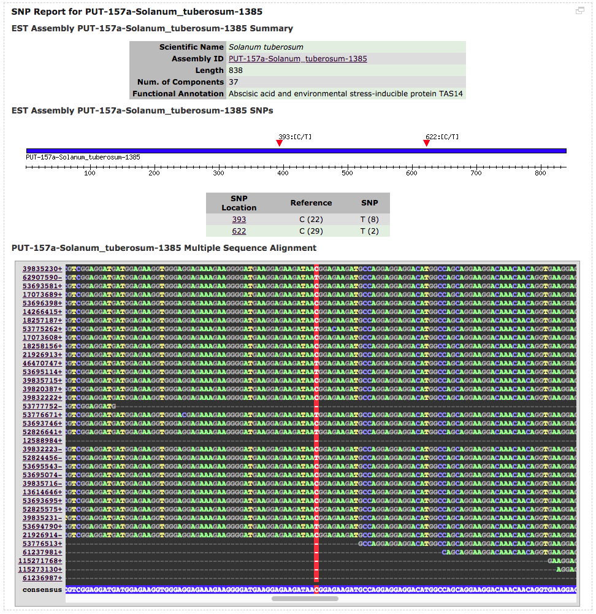

# Perl 5.8.8 dependencies

## From CPAN
The following Perl module dependencies (available from CPAN) have been excluded from the repo:

    Bio::Perl
    CGI
    Set::Scalar
    Statistics::Descriptive

## Custom

### Sol::SimpleAlign

Included here are custom modules:

    Sol::SimpleAlign::DBIReader
    Sol::SimpleAlign::Reader
    Sol::SimpleAlign::Util

The code uses BioPerl's Bio::SimpleAlign to allow rendering an HTML-based MSA viewer for
the site's SNP tools.

Requires proper CSS styling to be rendered properly, see '/htdocs/css/solcomp\_style.css#msa*'.

Here's an example screenshot of the module [in use on the site](https://web.archive.org/web/20100614155409/http://solanaceae.plantbiology.msu.edu/analyses_snp.php):

