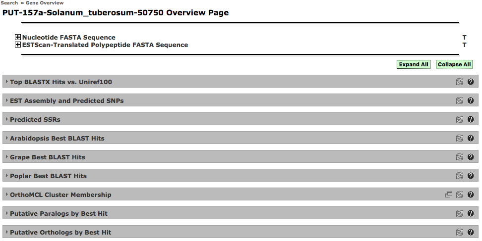

# Solanaceae Genomics Resource

This site was developed at MSU by Brett Whitty <brett@gnomatix.com> from Jan. 2008 - April. 2011.

See 'index.php' for site landing page.

## Some notes on contents:

### Custom JavaScript UI Class 'AjaxDiv'

A class for creating collapsible div elements that load their contents via an ajax call.
    
    ./js/AjaxDiv.js


Example usage:

```
<div id='test'></div>
<div id='test2'></div>
<script type="text/javascript">
    var divTest = new AjaxDiv('test', 'Test Header', '/cgi-bin/SNP/sol_snps.cgi?id=PUT-169a-Nicotiana_tabacum-77195', true);
    var divTest2 = new AjaxDiv('test2', 'Test Header', '/cgi-bin/orthomcl/orthomcl_view.cgi?id=PUT-157a-Solanum_tuberosum-11244', false);
</script>
```

Implemented using MooTools JavaScript framework for use primarily on the site's "Gene Overview" page.

### Use of 'AjaxDiv' in constructing "Gene Overview" page

    ./gene_overview.php

The "gene overview" page has a modular construction, and is made up of a collection of divs whose contents are provided by CGI scripts.



AjaxDiv simplifies the design of this page, and increased page loading speed by giving the option to have some divs initially rendered in a "closed" state.

Features allow custom CSS styling of each instance, optional header display with buttons for providing help text, popping the contents out as a separate window or as raw text (eg: FASTA format sequence for using as BLAST query). Uses cookies to maintain the open / closed state within a session based on user interaction.

### Dynamic content using '/cgi-bin/sitemap/\*' and 'htdocs/includes/\_content.\*.php'

See contents of './includes' and 'cgi-bin/sitemap'.

### Note on Spry framework dependency:
The initial visual design template for the site was developed using Adobe Dreamweaver which led to the use of the Spry framework for its drop down menus.
